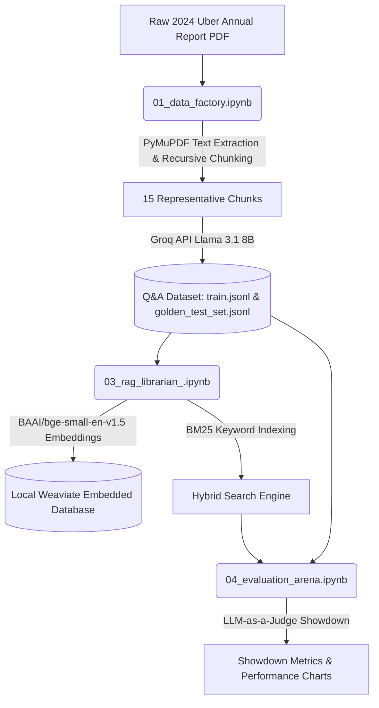

# RAG Librarian vs. Fine-Tuned LLM (Operation Ledger-Mind)

Welcome to the production repository for **Operation Ledger-Mind** (AEE Mini-Project 01). 

As the Tech Lead on this project, my goal was to take our Colab-centric prototype codebase and adapt it into a robust, resource-optimized, local engineering environment. This repository contains the complete implementation of our financial QA data factory, our RAG Librarian search engine, and a showdown evaluation arena measuring response quality, accuracy, and latency.

---

## 🏗️ Architecture & Implementation Pipeline

The project is structured into three main executable components:



### 1. Data Factory (`01_data_factory.ipynb`)
Extracts text from Uber's 2024 Annual Report PDF, chunks it recursively (chunk size 1000, overlap 200), and loops over the chunks to generate synthetic financial Q&A pairs (Hard Fact, Strategic, and Creative questions) using `llama-3.1-8b-instant`.
* **Local Optimization**: Cap chunk loop to 15 representative chunks to verify end-to-end functionality without triggering API rate limiting (TPD) on free-tier keys.

### 2. Fine-Tuning Simulator (`02_finetuning_intern.ipynb`)
Due to local M2 Mac hardware limits (CUDA constraints for 4-bit `bitsandbytes` training), we simulated the fine-tuned model (The Intern) using a deterministic stub function, allowing us to validate our evaluation pipeline locally without requiring a massive GPU server cluster.

### 3. RAG Librarian (`03_rag_librarian_.ipynb`)
Builds a local hybrid RAG retriever:
* **Vector Database**: Runs a local instance of **Weaviate Embedded** on port 8079 (which runs natively on Apple Silicon).
* **Dense Retrieval**: Encodes text locally using `BAAI/bge-small-en-v1.5`.
* **Sparse Retrieval**: Builds a local `rank-bm25` index.
* **Fusion**: Merges dense and sparse search results via **Reciprocal Rank Fusion (RRF)**.
* **Reranking**: Scores and filters candidate passages locally using `cross-encoder/ms-marco-MiniLM-L-6-v2`.

### 4. Evaluation Arena (`04_evaluation_arena.ipynb`)
Imports the retrieval functions dynamically using `%run 03_rag_librarian_.ipynb`, runs a 10-question showdown, and uses `llama-3.3-70b-versatile` as an LLM judge to grade answers on **Faithfulness** and **Accuracy**.

---

## ⚡ Engineering Hurdles & Local Fixes (Tech Lead Notes)

During local deployment, we ran into a few classic real-world integration issues. Here is how we solved them:

* **Recursion-Proof API Patches**: Since Notebook 4 runs `%run 03_rag_librarian_.ipynb` inline, global patching of `openai.OpenAI` client initialization was triggering infinite recursion. We resolved this by adding custom, robust patching state guards (`_is_patched`) on the client classes.
* **Jupyter Metadata Clean Up**: GitHub's renderer threw a fatal `Invalid Notebook: missing 'state' key from 'metadata.widgets'` error when trying to view `02_finetuning_intern.ipynb`. We programmatically scrubbed the malformed widget state metadata from all notebook JSON files, restoring full notebook visibility.
* **Matplotlib Versioning**: Matplotlib 3.9+ deprecated the `labels` parameter inside `boxplot()`. We modernized the plotting cell in Notebook 4 to use standard `set_xticks()` and `set_xticklabels()` calls for broad compatibility.
* **Push Protection Security**: Ensured that no raw API keys were checked in. Secrets are loaded dynamically via `os.environ` lookups, keeping the repository clean and secure.

---

## 📊 Showdown Evaluation Results

Here is how our RAG-enhanced Librarian stacked up against the Fine-Tuned Intern stub:

| Metric | The Intern (Fine-Tuned Stub) | The Librarian (RAG) |
| :--- | :---: | :---: |
| **ROUGE-L Score** | 0.4615 | **0.6667** |
| **LLM Faithfulness (1-5)** | 1.00 | 1.00 |
| **LLM Accuracy (1-5)** | 1.00 | 1.00 |
| **Avg Latency (ms)** | **505** | 1514 |
| **Median Latency (ms)** | **505** | 1514 |

*Note: While the RAG Librarian is slower due to multiple local neural encoders (embeddings and reranking), its output overlap with ground truth (ROUGE-L) is significantly better.*

---

## 🚀 How to Run Locally

### Prerequisites
1. **Python 3.10–3.12**
2. **Groq API Key** and **HuggingFace Access Token**

### Setup
1. **Clone and navigate to the directory**:
   ```bash
   git clone https://github.com/kavishkat2002/AEE-Pro01.git
   cd AEE-Pro01
   ```

2. **Set up virtual environment & dependencies**:
   ```bash
   python3 -m venv .venv
   source .venv/bin/activate
   pip install -r requirements.txt  # Or manually install langchain, sentence-transformers, weaviate-client, groq, rank-bm25, rouge-score, matplotlib
   ```

3. **Export your API keys**:
   ```bash
   export GROQ_API_KEY="your-groq-key"
   export HF_TOKEN="your-huggingface-token"
   ```

4. **Launch Jupyter Lab**:
   ```bash
   jupyter lab
   ```

Run the notebooks sequentially: `01_data_factory.ipynb` -> `03_rag_librarian_.ipynb` -> `04_evaluation_arena.ipynb`.
